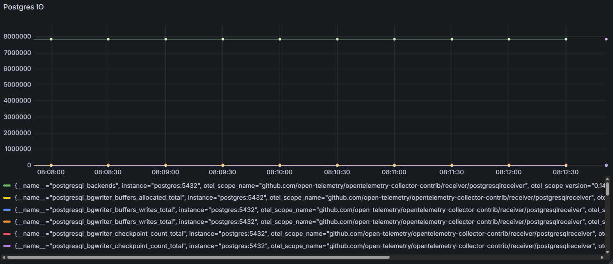

# Postgres IO UI
Showing Postgres IO, total size, and other metrics on Grafana

# How to access Grafana
1. expose grafana
```bash
kubectl port-forward svc/obs-grafana -n default 3000:80
```

2. login with admin/admin (http://localhost:3000)
3. go to `explore` and find `postgres` metric with labels `postgres=io`

